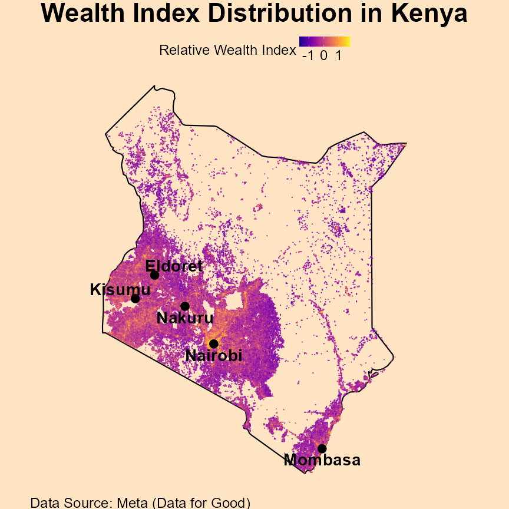

# African Data Visualizations

This repository contains a collection of data visualizations about various topics related to the African continent. 
The visualizations have been created using various tools and software, and they are meant to provide a concise explanation of various phenomena to policymakers and the general public.

***NOTE: Direct links to the code used to produce the image(s) below will be provided ASAP (if not provided already).***

Visualizations can be seen [here](https://linktr.ee/afro_dataviz) and [here](https://www.instagram.com/afro_dataviz/).

## Example visualizations

### 1) Relative Wealth Index (Kenya)

[Code](sub_pro_2_rel_wealth_index_meta/scripts/relative_wealth_index_east_africa.R)

### 2) Tea Production in Africa

[Code](sub_pro_1_agriculture_fao/r_scripts/fao_africa_1.R)

 

### 3) Africa's Fastest Growing Companies (2025)

[Code](sub_pro_11_africa_fast_grow_ft/r_scripts/africa_fast_grow_2025.R)

 

### 4) Olympic Medals in Africa

[Code](sub_pro_9_olympics_wpr_ioc/r_scripts/oly_africa_1896_2020.R)

